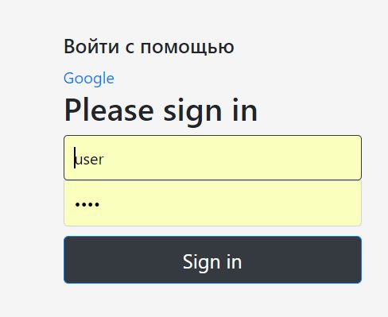
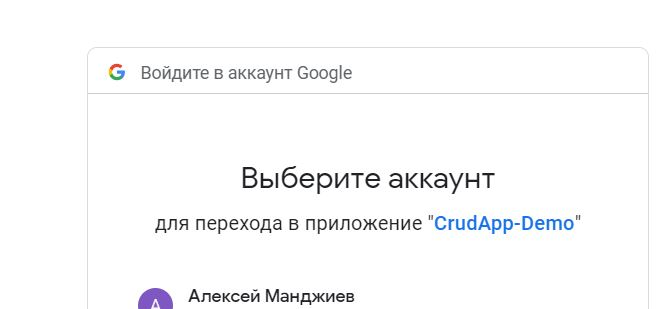
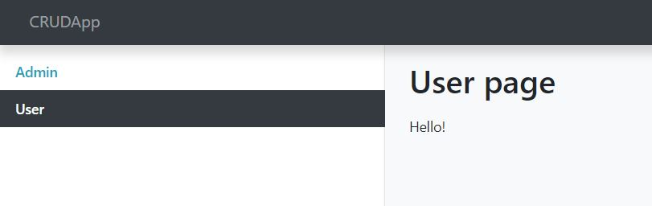
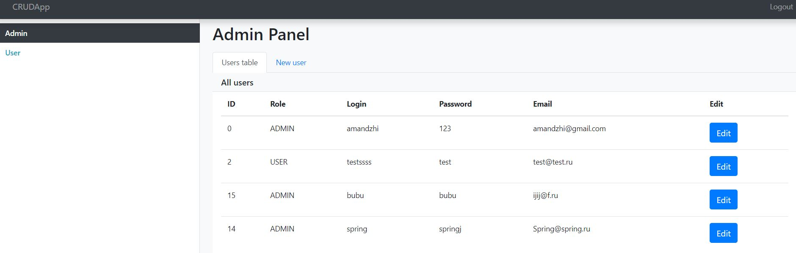
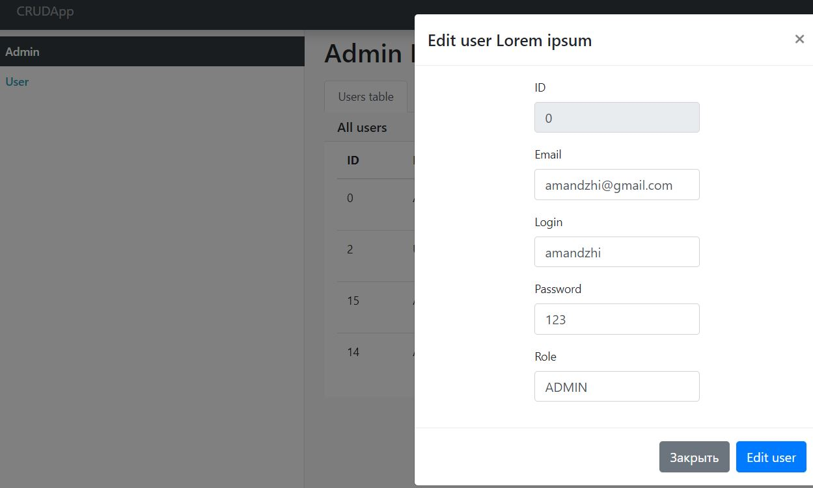
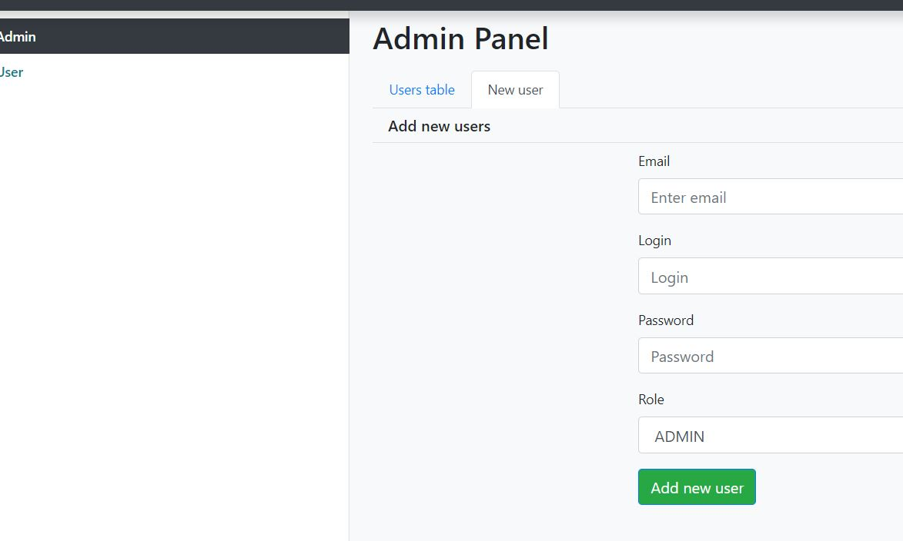

## CRUDApp

В приложении можно создавать, редактировать, получать списки пользователей.

##### Используемые технологии:

+ Maven
+ Spring Boot
+ Spring Data JPA
+ Spring MVC
+ Rest server and Rest Client(разные порты)
+ Spring security OAuth2 with Basic authentication 
+ MySql
+ Tomcat
+ Bootstrap
+ AJAX

Скриншоты приложения на клиенте:

Аутентификация на клиенте двумя способами: Basic и OAuth2 Google
Форма логина:

Аутентификация с помощю Google:

Страница пользователя

Страница администратора

Редактирование пользователя

Заведение нового пользователя

